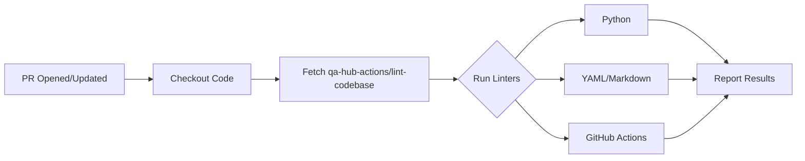

# 🚀 GitHub Actions Workflows

This directory contains the automated CI/CD pipelines for the **QA Hub Framework**.

## 🏗️ Available Pipelines

| Workflow | Trigger | Description |
|----------|---------|-------------|
| **Unit Tests** (`test.yml`) | Push/PR | Runs 17+ tests across a **Python Matrix (3.9 - 3.12)** and generates logic coverage reports. |
| **Security Audit** (`security.yml`) | Push/PR/Weekly | Scans dependencies with `Safety` and code with `Bandit` for vulnerabilities. |
| **Documentation** (`docs.yml`) | Push to `main` | Builds and deploys the [Wiki](https://carlos-camara.github.io/qa-hub-framework/) to GitHub Pages. |
| **Link Checker** (`links.yml`) | Push/PR/Weekly | Ensures no broken links exist in the documentation or README files. |
| **Semantic Release** (`release.yml`) | Push to `main` | Automates versioning, changelogs, and GitHub Releases. |
| **PR Labeler** (`pr-labeler.yml`) | Pull Request | Automatically categorizes PRs based on changed files (Core, Docs, CI, etc.). |
| **Code Linting** (`lint.yml`) | Push/PR | Ensures code style compliance via `flake8`. |

## 🧪 Quality Gates

To maintain high standards, every Pull Request must pass:
1. **Linting**: No style violations.
2. **Tests**: 100% pass rate across all Python versions.
3. **Security**: No known vulnerabilities in dependencies.
4. **Links**: Clean documentation.

---
*Built for scale and reliability.*

---

## 🛠️ Detailed Workflow Breakdown

### 1. Lint - Super-Linter (`lint.yml`)
Standardized linting across the entire repository. This workflow leverages the centralized action from [qa-hub-actions](https://github.com/carlos-camara/qa-hub-actions).

**Key Features:**
- **Decentralized Execution**: Always uses the latest stable rules from the actions repository.
- **Multi-language Support**: Automatically validates:
  - 🐍 **Python**: PEP8 and logic checks.
  - 📄 **YAML**: Structure and syntax.
  - 📝 **Markdown**: Formatting and links.
  - 🤖 **GitHub Actions**: Workflow best practices.

### 2. Auto Assign PR (`auto_assign.yml`)
Ensures that every Pull Request has an assignee from the moment it is created.

**Benefits:**
- **Accountability**: Clearly shows who is responsible for the PR.
- **Workflow Speed**: Eliminates the manual step of self-assigning.

---

## 🔧 Maintenance & Support

### Troubleshooting
If a workflow fails:
1. Check the logs in the **Actions** tab.
2. For Lint errors, run the corresponding linter locally (e.g., `flake8` for Python).
3. Ensure the `GITHUB_TOKEN` has the necessary permissions (defined in each YAML).

### Manual Triggers
Most workflows support `workflow_dispatch`, allowing you to run them manually from the GitHub UI for testing or one-off checks.

---

  Powered by <b>QA Hub Actions</b>

