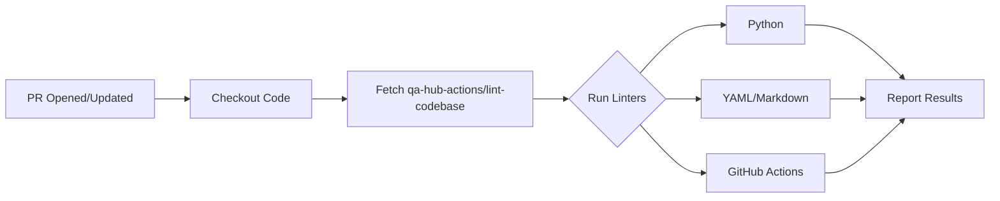

# ⚙️ GitHub Workflows Documentation

This directory contains the automation pipelines for the **QA Hub Framework**. These workflows ensure code quality, consistency, and efficient collaboration.

---

## 🚀 Workflows Overview

| Workflow | Trigger | Description | Integrations |
|----------|---------|-------------|--------------|
| **Lint - Super-Linter** | `PR`, `Manual` | Code quality and style enforcement. | `qa-hub-actions/lint-codebase` |
| **Auto Assign PR** | `PR Opened` | Automatically assigns PRs to the creator for faster review cycles. | Standard GitHub CLI |

---

## 🛠️ Detailed Workflow Breakdown

### 1. Lint - Super-Linter (`lint.yml`)
Standardized linting across the entire repository. This workflow leverages the centralized action from [qa-hub-actions](https://github.com/carlos-camara/qa-hub-actions).

**Key Features:**
- **Decentralized Execution**: Always uses the latest stable rules from the actions repository.
- **Multi-language Support**: Automatically validates:
  - 🐍 **Python**: PEP8 and logic checks.
  - 📄 **YAML**: Structure and syntax.
  - 📝 **Markdown**: Formatting and links.
  - 🤖 **GitHub Actions**: Workflow best practices.

### 2. Auto Assign PR (`auto_assign.yml`)
Ensures that every Pull Request has an assignee from the moment it is created.

**Benefits:**
- **Accountability**: Clearly shows who is responsible for the PR.
- **Workflow Speed**: Eliminates the manual step of self-assigning.

---

## 🔧 Maintenance & Support

### Troubleshooting
If a workflow fails:
1. Check the logs in the **Actions** tab.
2. For Lint errors, run the corresponding linter locally (e.g., `flake8` for Python).
3. Ensure the `GITHUB_TOKEN` has the necessary permissions (defined in each YAML).

### Manual Triggers
Most workflows support `workflow_dispatch`, allowing you to run them manually from the GitHub UI for testing or one-off checks.

---

  Powered by <b>QA Hub Actions</b>

