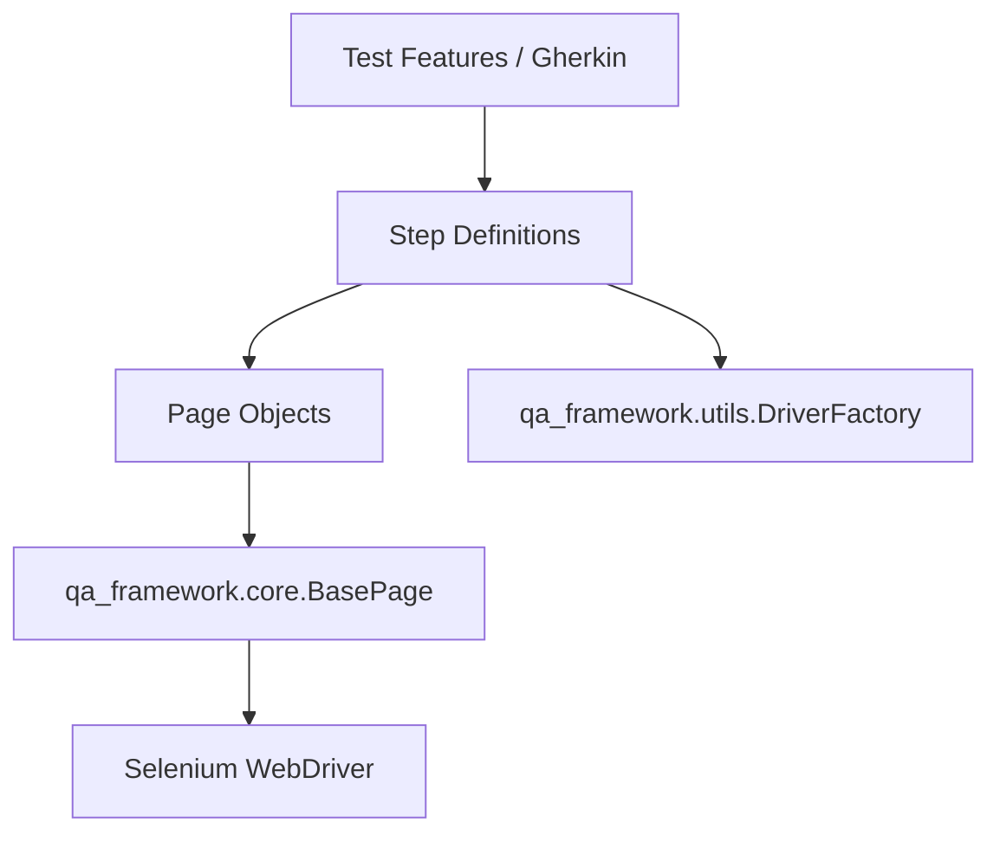

# 🚀 QA Hub Framework

[](https://www.python.org/)
[](https://www.selenium.dev/)
[](https://behave.readthedocs.io/)
[](https://opensource.org/licenses/MIT)

A **premium, reusable automated testing framework** designed to streamline test development for both UI and API layers. Built with scalability and maintainability in mind, leveraging the power of Python, Behave (BDD), and Selenium.

---

## ✨ Key Features

- 🏗️ **Page Object Model (POM)**: Standardized structure for UI testing using a robust `BasePage`.
- 🔌 **Plug-and-Play Integration**: Easily importable into any Python project via Git.
- 🐳 **Pipeline Ready**: Optimized for CI/CD environments with headless Chrome support and standard configurations.
- 📝 **BDD Integration**: Seamless support for Gherkin syntax via Behave.
- 🛠️ **Utility Suite**: Built-in driver factory and common steps to reduce boilerplate code.

---

## 🏗️ Architecture Overview

The framework follows a modular architecture to ensure separation of concerns:



For more details on our core components, see [ARCHITECTURE.md](./ARCHITECTURE.md).  
For the full list of reusable Gherkin steps, see [STEPS.md](./STEPS.md).  
For information on our CI/CD pipelines, see [.github/workflows/README.md](./.github/workflows/README.md).

---

## 🚀 Quick Start

### 1. Installation

Add the framework to your `requirements.txt`:

```text
-e git+https://github.com/carlos-camara/qa-hub-framework.git#egg=qa-automation-framework
```

Then install dependencies:

```bash
pip install -r requirements.txt
```

### 2. Basic Usage

Inherit from `BasePage` to create your own page objects:

```python
from qa_framework.core.base_page import BasePage
from selenium.webdriver.common.by import By

class LoginPage(BasePage):
    USERNAME_INPUT = (By.ID, "username")
    
    def login(self, username):
        self.send_keys(self.USERNAME_INPUT, username)
```

---

## 🛠️ Configuration

The framework uses environment variables and standard Python configurations. The `get_driver` utility supports:

| Parameter | Default | Description |
|-----------|---------|-------------|
| `headless` | `True` | Run browser without GUI (ideal for CI) |
| `window_size` | `1365,768` | Initial browser viewport size |
| `no_sandbox` | `True` | Essential for Linux/Docker environments |

---

## 📄 License

This project is licensed under the MIT License - see the [LICENSE](LICENSE) file for details.

---

<p align="center">
  Developed with ❤️ for the QA Engineering community.
</p>
