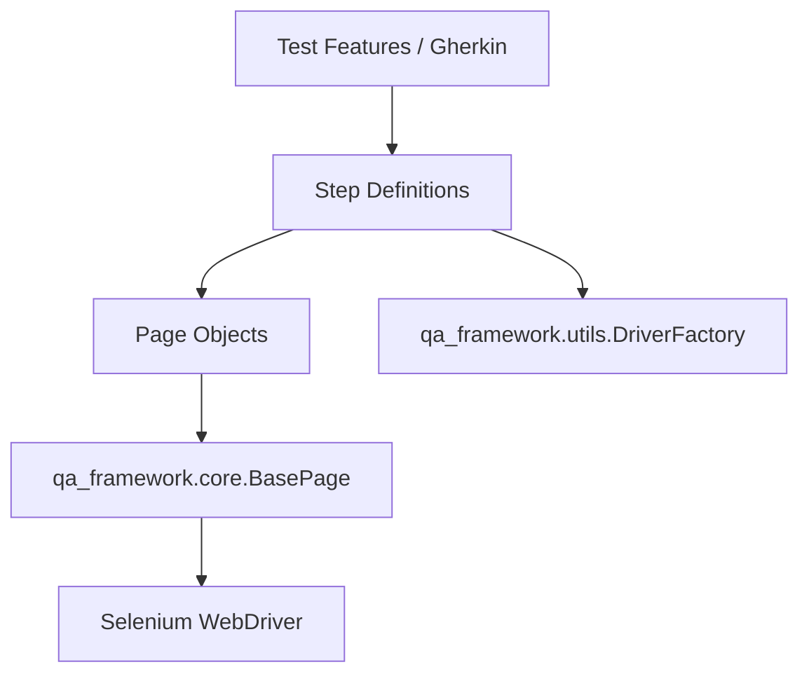

# 🚀 QA Hub Framework

[](https://www.python.org/)
[](https://www.selenium.dev/)
[](https://behave.readthedocs.io/)
[](https://opensource.org/licenses/MIT)

A **premium, reusable automated testing framework** designed to streamline test development for both UI and API layers. Built with scalability and maintainability in mind, leveraging the power of Python, Behave (BDD), and Selenium.

---

## ✨ Key Features

- 🏗️ **Page Object Model (POM)**: Standardized structure for UI testing using a robust `BasePage`.
- 🎭 **Dual-Driver Engine**: Native support for both **Selenium** and **Playwright**, switchable via configuration.
- 🎨 **Visual Regression Engine**: RMS-based image comparison with configurable tolerance and automated baseline management.
- ⚙️ **Surgical Lifecycle Management**: Advanced driver reuse logic (Global, Feature, or Scenario level) to optimize execution speed.
- **Gherkin-First**: Focused on readable and maintainable test scenarios with professional syntax.
- **Remote-Ready**: Easily installable via Git for CI/CD pipelines.
- 🐳 **Pipeline Ready**: Optimized for CI/CD environments with headless support and automated driver management.
- 🛠️ **Utility Suite**: Built-in element factory and common steps to reduce boilerplate code.

---

## 📖 Documentation

Check out our professional [Documentation Site](https://carlos-camara.github.io/qa-hub-framework/) for detailed guides on API, GUI, and PDF testing.

---

## 🏗️ Architecture Overview

The framework follows a modular architecture to ensure separation of concerns:



For more details on our core components, see [ARCHITECTURE.md](./ARCHITECTURE.md).  
For the full list of reusable Gherkin steps, see [STEPS.md](./STEPS.md).  
For information on our CI/CD pipelines, see [.github/workflows/README.md](./.github/workflows/README.md).

---

## 🚀 Quick Start

### 1. Installation

Add the framework to your `requirements.txt`:

```text
-e git+https://github.com/carlos-camara/qa-hub-framework.git#egg=qa-automation-framework
```

Then install dependencies:

```bash
pip install -r requirements.txt
```

### 2. Basic Usage

Inherit from `BasePage` to create your own page objects:

```python
from qa_framework.core.base_page import BasePage
from selenium.webdriver.common.by import By

class LoginPage(BasePage):
    USERNAME_INPUT = (By.ID, "username")
    
    def login(self, username):
        self.send_keys(self.USERNAME_INPUT, username)
```

---

### 3. Modern Driver Configuration

The framework supports switching between **Selenium** and **Playwright** via `features/config/properties.cfg`:

```ini
[Driver]
web_library: playwright  # selenium | playwright
type: chrome             # chrome | firefox | edge
headless: true
```

| Parameter | Default | Description |
|-----------|---------|-------------|
| `web_library` | `selenium` | Choose between Selenium or Playwright backends |
| `headless` | `True` | Run browser without GUI (ideal for CI) |
| `window_width` | `1366` | Custom viewport width |
| `window_height` | `768` | Custom viewport height |

---

## 🎨 Visual Regression Testing

The framework includes a professional-grade image comparison engine.

- **Baseline Management**: Missing baselines are automatically seeded during the first run.
- **RMS Error Calculation**: High-fidelity detection of layout shifts and CSS glitches.
- **Agnostic Logic**: Works identically across Selenium and Playwright backends.

```gherkin
Then the "stats grid" element should visually match the baseline image "dashboard_stats" with a 5.0% tolerance
```

---

## 🎭 Playwright Integration

The framework supports Playwright as an alternative to Selenium, offering faster execution and better stability for modern web apps.

### Installation

After installing requirements, run the Playwright browser installer:

```bash
pip install -r requirements.txt
playwright install
```

> [!NOTE]
> The `playwright install` command downloads browser binaries. For CI environments, you may need to run `playwright install-deps` first.

### Configuration

To use Playwright instead of Selenium, configure `features/config/properties.cfg`:

```ini
[Driver]
web_library: playwright
type: chrome          # chrome | firefox | edge | webkit
headless: true
```

### Supported Browsers

| Browser    | Selenium | Playwright |
|------------|----------|------------|
| Chrome     | ✅       | ✅         |
| Firefox    | ✅       | ✅         |
| Edge       | ✅       | ✅         |
| WebKit     | ❌       | ✅         |

> [!TIP]
> WebKit is the engine behind Safari. Use it for cross-browser testing without macOS.

---


## 🛠️ Configuration

The framework uses environment variables and standard Python configurations. The `get_driver` utility supports:

| Parameter | Default | Description |
|-----------|---------|-------------|
| `headless` | `True` | Run browser without GUI (ideal for CI) |
| `window_size` | `1365,768` | Initial browser viewport size |
| `no_sandbox` | `True` | Essential for Linux/Docker environments |

---

## 📄 License

This project is licensed under the MIT License - see the [LICENSE](LICENSE) file for details.

---
