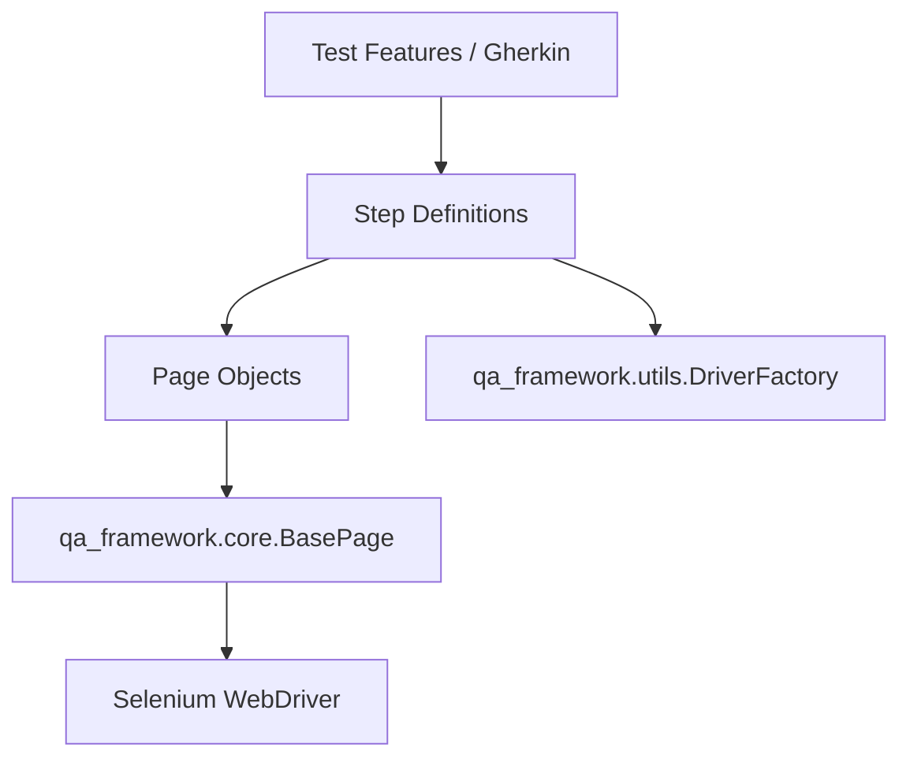

<div align="center">
  <h1>🚀 QA Hub Framework</h1>
  <p><i>The Precision Engineering Core for Automated Quality Assurance.<br>A premium, ultra-professional BDD framework bridging high-scale technical validation and surgical-grade reporting.</i></p>

  [](https://python.org)
  [](https://selenium.dev)
  [](https://playwright.dev)
  [](https://github.com/carlos-camara/qa-hub-framework/blob/main/LICENSE)
</div>

---

## ✨ Key Features

- 🏗️ **Page Object Model (POM)**: Standardized structure for UI testing using a robust `BasePage`.
- 🛠️ **Dedicated CLI Tool (`qa-hub`)**: Simplified test execution with environmental and tag overrides.
- 🪵 **Contextual Logger**: Professional, colorized logs with automatic Feature/Scenario context.
- 🛡️ **Security Sanity Checks**: Built-in steps for API header hygiene and cookie security validation.
- 🎭 **Dual-Driver Engine**: Native support for both **Selenium** and **Playwright**, switchable via configuration.
- 🎨 **Visual Regression Engine**: RMS-based image comparison with automated baseline management.
- ⚙️ **Surgical Lifecycle Management**: Advanced driver reuse logic to optimize execution speed.
- 🧪 **CI/CD Orchestration**: Seamless integration with GitHub Actions and detailed audit logs.

---

## 📖 Documentation

Check out our professional [Documentation Site](https://carlos-camara.github.io/qa-hub-framework/) for detailed guides on API, GUI, and PDF testing.

---

## 🏗️ Architecture Overview

The framework follows a modular architecture to ensure separation of concerns:



For more details on our core components, see [ARCHITECTURE.md](./ARCHITECTURE.md).  
For the full list of reusable Gherkin steps, see [STEPS.md](./STEPS.md).  
For information on our CI/CD pipelines, see [.github/workflows/README.md](./.github/workflows/README.md).

---

## 🚀 Quick Start

### 1. Installation

Add the framework to your `requirements.txt`:

```text
-e git+https://github.com/carlos-camara/qa-hub-framework.git#egg=qa-automation-framework
```

Then install dependencies:

```bash
pip install -r requirements.txt
# Verify the CLI tool
qa-hub --help
```

### 2. Basic Execution
Run your tests using the dedicated CLI tool:

```bash
# Run all smoke tests in staging
qa-hub run --env staging --tags smoke
```

---

## 🛠️ Configuration Manager

The framework uses a centralized configuration system (`features/config/config.yaml`) that supports environment overrides (`staging`, `prod`) and secret management (`.env`).

For a detailed setup guide and advanced usage, see [Configuration Guide](./docs/configuration.md).

---

## 🛠️ Command Line Interface (`qa-hub`)

The framework provides a powerful CLI to manage your test runs efficiently.

```bash
qa-hub run [OPTIONS]
```

| Option | Description |
|--------|-------------|
| `--env` | Set execution environment (local, dev, staging, prod) |
| `--tags` | Filter by Gherkin tags (e.g., `@smoke`) |
| `--browser` | Override browser (chrome, firefox, playwright) |
| `--fail` | Stop execution on the first failure |
| `--no-capture` | Show real-time logs and prints |
| `--junit-dir` | Directory for JUnit XML reports |

For more details, see the [CLI Guide](./docs/cli.md).

---

## 🪵 Contextual Logging

Every execution is enriched with a high-fidelity audit trail.

- **Automatic Context**: Logs automatically include `[Feature | Scenario]` names.
- **Colorized Output**: Visual differentiation between INFO, SUCCESS, WARNING, and ERROR.
- **Timestamps**: Precision timing for every action.

See [Logging Documentation](./docs/logging.md) for configuration and usage.

---

## 🛡️ Security Sanity Checks

Validate your API security posture with built-in audit steps.

- **Metadata Leaks**: Detect if your server leaks technology versions.
- **Security Headers**: Verify presence of HSTS, CSP, and X-Frame-Options.
- **Cookie Security**: Audit session cookies for Secure, HttpOnly, and SameSite flags.

Check the [Security Guide](./docs/security.md) for implementation details.

---

## 🎨 Visual Regression Testing

The framework includes a professional-grade image comparison engine.

- **Baseline Management**: Missing baselines are automatically seeded during the first run.
- **RMS Error Calculation**: High-fidelity detection of layout shifts and CSS glitches.
- **Agnostic Logic**: Works identically across Selenium and Playwright backends.

```gherkin
Then the "stats grid" element should visually match the baseline image "dashboard_stats" with a 5.0% tolerance
```

---

## ⚡ Global Step Registry

The framework provides an extensive library of modular Gherkin steps across all testing layers, reducing project-specific boilerplate.

### 🔌 API Validation
- `Then the response JSON path "{path}" should equal "{expected}"` (Alias for precision matching)
- `Then the response JSON path "{path}" should be a "{py_type}"` (Type-safe assertions)

### 📄 Intelligent PDF Audit
- `Then I verify the content of the first {count:d} pages of "{filename}"` (Non-empty extraction check)
- `Then the PDF "{filename}" should have at least {page_count:d} pages`

### 🏗️ Foundation & Stability
- `And I wait for "{name}" to be stable` (Generic animation/load placeholder)
- `When I store the text of the "{element_name}" as "{var_name}"` (Dynamic data extraction)

### 🎨 Masked Visual Comparison
- `Then the "{desc}" page should visually match the baseline image "{name}" without elements and with a {threshold:f}% tolerance`
  (Allows blacking out dynamic elements like charts or dates to prevent false positives).

---

## 🎭 Playwright Integration

The framework supports Playwright as an alternative to Selenium, offering faster execution and better stability for modern web apps.

### Installation

After installing requirements, run the Playwright browser installer:

```bash
pip install -r requirements.txt
playwright install
```

> [!NOTE]
> The `playwright install` command downloads browser binaries. For CI environments, you may need to run `playwright install-deps` first.

### Configuration

To use Playwright instead of Selenium, configure `features/config/properties.cfg` or `config.yaml`:

```yaml
Driver:
  web_library: playwright
  type: chrome
  headless: true
```

### Supported Browsers

| Browser    | Selenium | Playwright |
|------------|----------|------------|
| Chrome     | ✅       | ✅         |
| Firefox    | ✅       | ✅         |
| Edge       | ✅       | ✅         |
| WebKit     | ❌       | ✅         |

> [!TIP]
> WebKit is the engine behind Safari. Use it for cross-browser testing without macOS.

---

## 📄 License

This project is licensed under the MIT License - see the [LICENSE](LICENSE) file for details.

---
