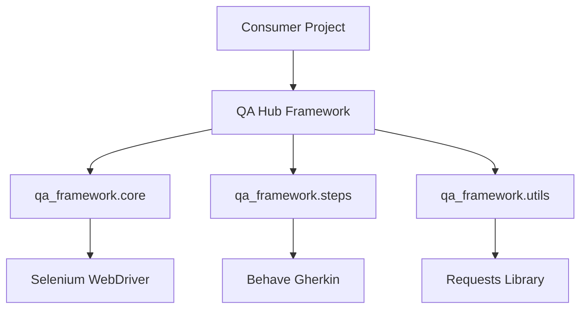

<div align="center">
  <h1>🏗️ Architecture Deep-Dive</h1>
  <p><i>Navigating the modular engine of the QA Hub Ecosystem.</i></p>
</div>

---

The **QA Hub Framework** is designed with modularity and reusability at its core. It separates low-level automation logic from high-level test specifications.

## 🗺️ Component Diagram



## 📁 Project Structure

- **`qa_framework/core/`**: Base classes like `BasePage` and driver management logic.
- **`qa_framework/steps/`**: Specialized Gherkin steps (API, GUI, PDF, Common).
- **`qa_framework/utils/`**: Helper functions for JSON parsing, HTTP handling, and data transformation.

## 🧩 Extension Model

The framework follows a "Base Class" pattern. Projects should inherit from the framework's core classes to add specific functionality.

### Example: Page Objects
```python
from qa_framework.core.base_page import BasePage

class MyDashboardPage(BasePage):
    # Specialized locators and actions
    pass
```

---

*Built for scalability and developer happiness.*
