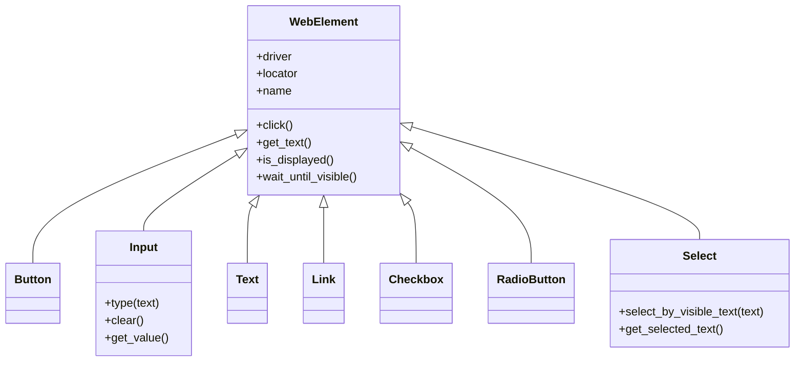

# Element Types

The QA Hub Framework provides a rich library of typed elements that encapsulate Selenium/Playwright interactions into semantic methods. This "Element Wrapper" pattern improves test readability and maintainability.

## Architecture

All elements inherit from the base `WebElement` class, which provides core functionalities like finding elements, waiting, and basic interactions.



---

## Core Elements

### WebElement
The base class for all elements. Use this for generic HTML elements (div, span, etc.).

| Method | Description |
| :--- | :--- |
| `click()` | Performs a click on the element. |
| `get_text()` | Returns the visible text content. |
| `is_displayed()` | Checks if the element is currently visible. |
| `get_attribute(name)` | Retrieves a specific HTML attribute. |

### Button
Specialized for `<button>` or clickable elements. Inherits all `WebElement` methods.

### Input
Designed for `<input>` and `<textarea>` fields.

- `type(text)`: Types text into the field.
- `clear()`: Clears the field content.
- `clear_and_type(text)`: Combines clear and type for reliability.
- `get_value()`: Returns the content of the `value` attribute.

---

## Form Elements

### Select (Dropdowns)
Wraps Selenium's `Select` class to provide easy dropdown management.

!!! tip "Select Matching"
    The `get_text()` method on a `Select` element automatically returns the **currently selected option text**, making it compatible with generic text verification steps.

- `select_by_visible_text(text)`
- `select_by_value(value)`
- `get_selected_text()`
- `get_all_options_text()`

### Checkbox & Radio
Semantic helpers for toggleable elements.

- `check()` / `uncheck()`: Sets the state regardless of current state.
- `is_checked()` / `is_selected()`: Returns boolean state.
- `toggle()`: Inverts the current state.

### Link
Helpers for `<a>` tags and navigation.

- `get_href()`: Returns the URL.
- `get_target()`: Returns the target attribute (e.g., `_blank`).
- `opens_in_new_tab()`: Boolean check for `target="_blank"`.

---

## Element Factory

The `ElementFactory` is the engine that converts YAML locators into typed objects. It allows you to define elements by type in your page objects:

```yaml
# features/page_objects/login.yml
login_button:
  type: button
  by: id
  value: submit-login
```

!!! note "Custom Elements"
    You can register your own custom element types using `ElementFactory.register_custom_element(type_name, class_ptr)`.
